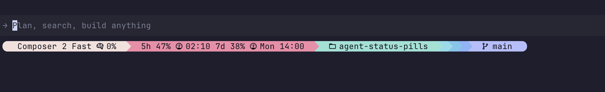

# agent-status-pills

A [Catppuccin](https://github.com/catppuccin/catppuccin)-themed status bar for [Claude Code](https://code.claude.com/docs/en/statusline) and the [Cursor CLI](https://cursor.com). Both pass the same status-line JSON on stdin. Four palettes: Mocha (default), Latte, Frappe, Macchiato.

### Claude Code


### Cursor CLI



Model name, context window usage, 5h and 7d rate limits with reset times, cwd, git branch, Square agents if configured, RTK savings, and token I/O, rendered as one row of Powerline pills along the bottom of the terminal.

## Requirements

- Terminal with [Nerd Font](https://www.nerdfonts.com/) support (Powerline glyphs)
- Node.js 18+
- `jq` and `python3` on PATH

## Install

```sh
npx @mvfsilva/agent-status-pills
npx @mvfsilva/agent-status-pills --theme latte
```

Themes: `mocha` (default), `latte`, `frappe`, `macchiato`.

By default this installs for Claude Code (`~/.claude/`, `settings.json`). For Cursor CLI:

```sh
npx @mvfsilva/agent-status-pills --target cursor
npx @mvfsilva/agent-status-pills --target both --theme frappe
```

The installer updates `~/.cursor/cli-config.json` and drops `~/.cursor/statusline.conf`. Input matches Claude Code's status line format. Rate-limit pills from Anthropic OAuth only appear when the payload includes `rate_limits` or a Claude Code token is available; model, context %, cwd, git, and token segments behave the same under Cursor.

Restart Claude Code or start a new Cursor CLI session after installing.

## Manual setup

1. Copy `statusline.sh` to `~/.claude/statusline.sh` and make it executable:
   ```sh
   chmod +x ~/.claude/statusline.sh
   ```

2. Pick a theme by creating `~/.claude/statusline.conf`:
   ```sh
   STATUSLINE_THEME=frappe
   ```

3. Add to `~/.claude/settings.json` (Claude Code) or `~/.cursor/cli-config.json` (Cursor CLI):
   ```json
   {
     "statusLine": {
       "type": "command",
       "command": "~/.claude/statusline.sh",
       "padding": 0
     }
   }
   ```

   For Cursor, point `"command"` at `~/.cursor/statusline.sh` and set `"padding"` to taste (often `2`).

4. Restart Claude Code or the Cursor CLI.

## License

MIT
