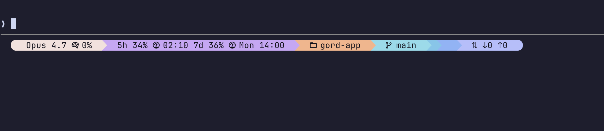

# claude-status-pills

A status bar for Claude Code terminals, styled with [Catppuccin Mocha](https://github.com/catppuccin/catppuccin) colors.



Each session gets a row of colored pills — model name, context window usage, 5h/7d rate limits with reset times, current directory, git branch, active Square agents, RTK savings, and token I/O. Colors cycle across the full Mocha accent palette in rainbow order.

## Requirements

- Terminal with [Nerd Font](https://www.nerdfonts.com/) support (Powerline glyphs)
- Node.js 18+
- `jq` and `python3` on PATH

## Install

```sh
npx @mvfsilva/claude-status-pills
```

Copies `statusline.sh` to `~/.claude/` and wires up `settings.json`. Restart Claude Code after running.

## Manual setup

1. Copy `statusline.sh` to `~/.claude/statusline.sh` and make it executable:
   ```sh
   chmod +x ~/.claude/statusline.sh
   ```

2. Add to `~/.claude/settings.json`:
   ```json
   {
     "statusLine": {
       "type": "command",
       "command": "~/.claude/statusline.sh",
       "padding": 0
     }
   }
   ```

3. Restart Claude Code.

## License

MIT
